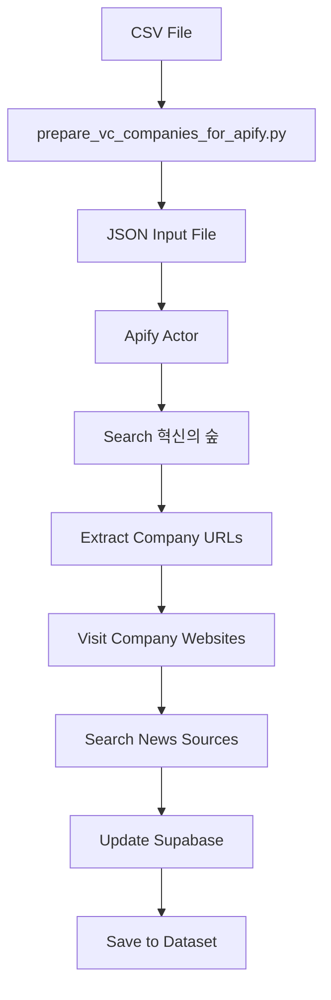

# 🔍 VC Company URL & Representative Matcher

Automated Apify actor to match Korean VC company names with their website URLs and 대표이사/CEO information.

## 🎯 Purpose

This actor helps you automatically find:
- **Company Website URLs** - Official company websites
- **대표이사/CEO Names** - Company representatives and executives

For a list of Korean VC companies, updating your Supabase `vc_table` with this information.

## 📊 Data Sources & Priority Order

1. **혁신의 숲 (InnoForest) with Login** - **BEST**: Authenticated database access for URLs and 대표이사
2. **Public Korean Business Sources** - Fallback: Naver search, Google Korea for company info  
3. **News Articles (최우선)** - **HIGHEST PRIORITY** for current 대표이사 information
4. **Company Websites** - Team pages and 인사말 sections for verification

**Priority Logic**: 
- **InnoForest authenticated** provides most comprehensive company data
- **News articles** always override 대표이사 information (most current)
- **Public sources** used when InnoForest login fails or credentials not provided

## 🚀 Quick Start

### 1. Prepare Your Data

Use the included Python script to convert your CSV file:

```bash
python prepare_vc_companies_for_apify.py "path/to/your/vc_list.csv" --limit 10
```

This creates `vc_companies_apify_input.json` ready for Apify.

### 2. Deploy to Apify

1. **Create New Actor** in your Apify Console
2. **Upload** the `main.js` and `package.json` files
3. **Set Environment Variables**:
   - `SUPABASE_URL` - Your Supabase project URL
   - `SUPABASE_KEY` - Your Supabase service role key
   - `INNOFOREST_USERNAME` - Your InnoForest login email (optional)
   - `INNOFOREST_PASSWORD` - Your InnoForest login password (optional)

### 3. Configure Input

```json
{
  "vcCompanies": [
    "카카오벤처스",
    "네이버투자",
    "... more companies ..."
  ],
  "supabaseUrl": "https://your-project.supabase.co",
  "supabaseKey": "your-service-role-key",
  "innoforestUsername": "your-innoforest-email",
  "innoforestPassword": "your-innoforest-password",
  "maxConcurrency": 1,
  "delayBetweenRequests": 3000,
  "maxCompanies": 10
}
```

### 4. Run the Actor

The actor will:
- Search each company in 혁신의 숲
- Extract website URLs and representative names
- Update your Supabase `vc_table` automatically
- Save results to Apify dataset

## 📋 Input Parameters

| Parameter | Type | Required | Description |
|-----------|------|----------|-------------|
| `vcCompanies` | Array[String] | ✅ | List of Korean VC company names |
| `supabaseUrl` | String | ❌ | Your Supabase project URL |
| `supabaseKey` | String | ❌ | Your Supabase API key (service role) |
| `innoforestUsername` | String | ❌ | InnoForest login username/email |
| `innoforestPassword` | String | ❌ | InnoForest login password |
| `maxConcurrency` | Integer | ❌ | Max concurrent requests (default: 1) |
| `delayBetweenRequests` | Integer | ❌ | Delay between requests in ms (default: 3000) |
| `maxCompanies` | Integer | ❌ | Limit companies for testing |

### 🌲 InnoForest Authentication (Recommended)

For best results, provide InnoForest credentials:
- **Primary Source**: Uses authenticated InnoForest database access
- **Better Data Quality**: More accurate company URLs and 대표이사 information  
- **Fallback**: If login fails or no data found, falls back to public Korean business sources
- **Environment Variables**: Can also use `INNOFOREST_USERNAME` and `INNOFOREST_PASSWORD`

**Note**: Without InnoForest credentials, the actor uses public Naver/Google searches which may have lower accuracy.

## 📈 Output Format

Each processed company returns:

```json
{
  "company_name": "카카오벤처스",
  "website_url": "https://www.kakaoventures.com",
  "representative": "대표이사 김철수",
  "sources": ["혁신의 숲", "Company Website"],
  "processing_date": "2024-01-15T10:30:00.000Z"
}
```

## 🎛️ Three-Fold Processing Strategy

### Step 1: 혁신의 숲 (InnoForest) - Basic Info 🌲
- Searches [innoforest.co.kr](https://www.innoforest.co.kr/) database
- Extracts company website URLs (primary goal)
- Gets initial 대표이사 info (potentially outdated)

### Step 2: News Search (최우선) - Current 대표이사 📰
- **HIGHEST PRIORITY** for representative information
- Multiple search queries on Naver News
- Looks for recent press releases and appointments
- Uses advanced pattern matching for 대표이사 extraction
- **Overrides all other representative sources**

### Step 3: Company Website - Verification 🌐
- Visits official company websites if URL found
- Checks Team, About, or 인사말 pages
- Used only if no news information found
- Provides secondary verification

**Key Priority**: News articles always take precedence for 대표이사 information as they contain the most current data.

## 💾 Supabase Integration

The actor automatically updates your `vc_table` with:
- `website_url` - Official company website
- `representative` - CEO/대표이사 information
- `updated_at` - Timestamp of update

**Note**: Only updates existing records. Companies must already exist in your `vc_table`.

## ⚙️ Configuration Options

### For Testing
```json
{
  "vcCompanies": ["카카오벤처스", "네이버투자"],
  "maxCompanies": 5,
  "maxConcurrency": 1,
  "delayBetweenRequests": 5000
}
```

### For Production
```json
{
  "vcCompanies": [...], // Full company list
  "maxConcurrency": 2,
  "delayBetweenRequests": 3000,
  "supabaseUrl": "your-url",
  "supabaseKey": "your-key",
  "innoforestUsername": "your-innoforest-email",
  "innoforestPassword": "your-innoforest-password"
}
```

## 📊 Success Metrics

The actor tracks:
- **Total Processed** - Number of companies processed
- **Found URLs** - Companies with website URLs found
- **Found Representatives** - Companies with CEO info found
- **Updated Records** - Supabase records successfully updated
- **Success Rate** - Overall success percentage

## 🔧 Troubleshooting

### Common Issues

**"No existing record found"**
- Company name doesn't match existing `vc_table` records
- Try fuzzy matching or manual name verification

**"Missing Supabase credentials"**
- Set `SUPABASE_URL` and `SUPABASE_KEY` environment variables
- Or provide them in actor input

**"Rate limiting errors"**
- Increase `delayBetweenRequests` to 5000+ ms
- Set `maxConcurrency` to 1 for stability

### Performance Tips

1. **Start Small** - Use `maxCompanies: 10` for testing
2. **Rate Limiting** - Korean sites prefer slower requests (3-5s delay)
3. **Monitoring** - Check Apify logs for success/failure patterns
4. **Batch Processing** - Process companies in smaller batches

## 🔄 Data Processing Workflow



## 📱 Mobile & Responsive

The actor handles:
- Mobile-responsive company websites
- Dynamic JavaScript content
- Anti-bot protection (with delays)
- Multiple encoding formats (UTF-8, EUC-KR)

## 🔐 Security & Privacy

- Uses headless browsing for privacy
- Respects robots.txt where applicable
- Rate limiting to avoid overwhelming servers
- Secure credential handling through Apify secrets

## 📞 Support

For issues or questions:
1. Check Apify actor logs for specific errors
2. Verify CSV file format and encoding
3. Test with small company batches first
4. Ensure Supabase credentials are correct

## 🚀 Next Steps

After running the actor:
1. **Review Results** - Check the Apify dataset for accuracy
2. **Verify Updates** - Confirm Supabase `vc_table` was updated
3. **Manual Review** - Some companies may need manual verification
4. **Scale Up** - Process full company list after successful testing

---

**Ready to find Korean VC company information automatically!** 🎯 